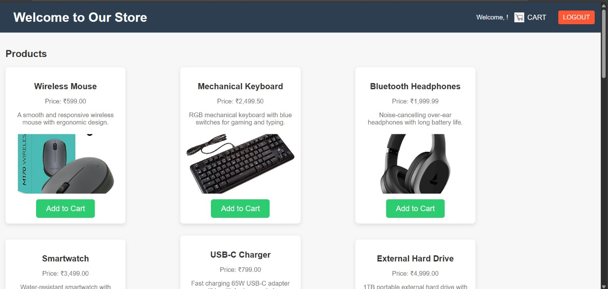
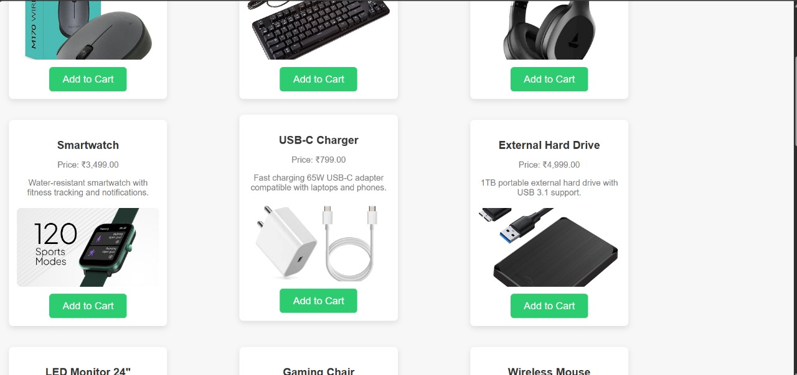
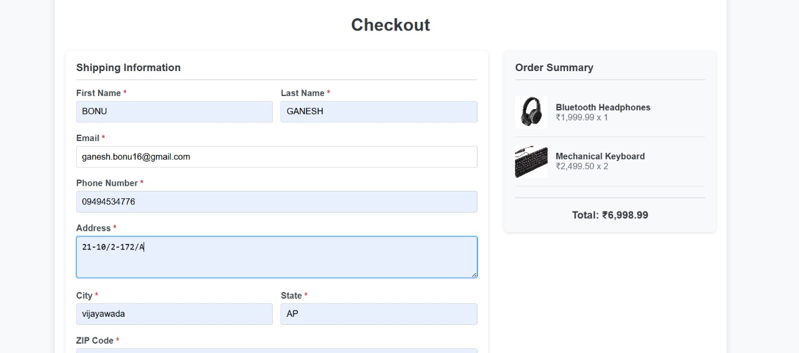
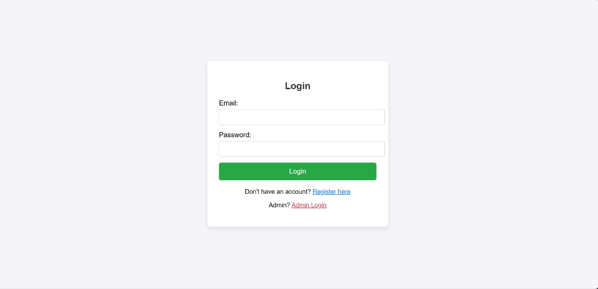
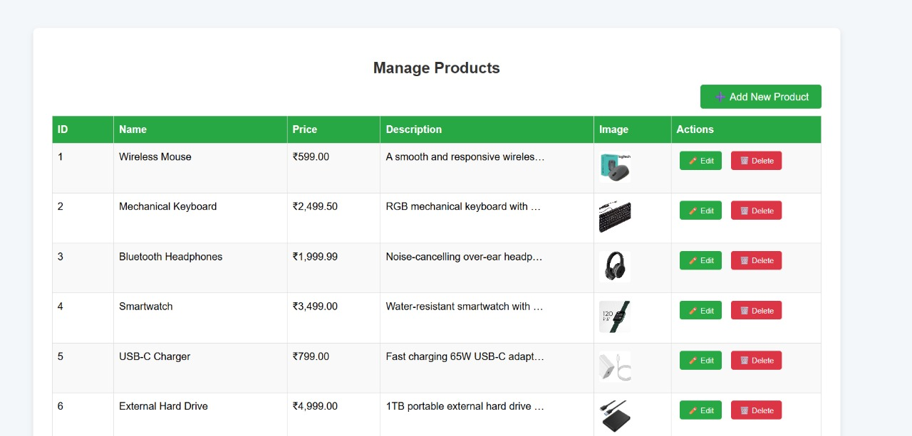
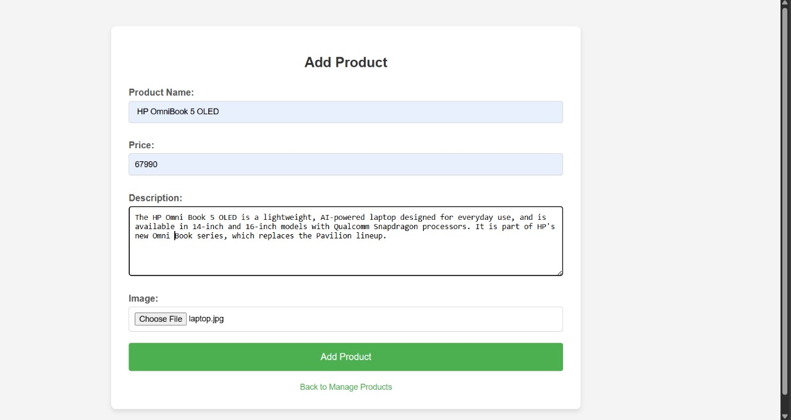
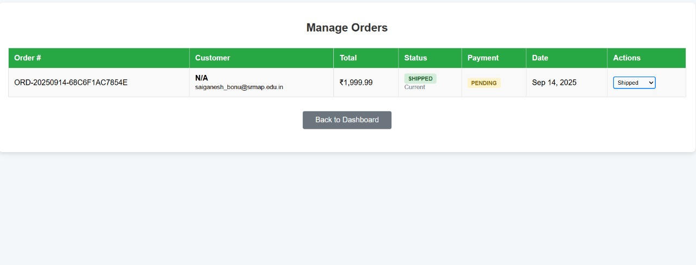

# 🛒 Ecommerce Application

A complete, modern ecommerce web application built with PHP, MySQL, and responsive CSS. Features a full shopping experience with admin panel, user authentication, and secure checkout system.


## 📸 Screenshots

### 🏠 **Main Store Page**

*Product catalog with responsive design and shopping cart integration*

### 🛒 **Product Catalog**

*Browse products with images, descriptions, and add to cart functionality*

### 💳 **Checkout Process**

*Complete checkout form with validation and order processing*

### 🔐 **User Authentication**

*Secure login system with role-based access control*

### 👨‍💼 **Admin Dashboard - Product Management**

*Full CRUD operations for product management with responsive table*

### 📦 **Add New Product**

*Admin interface for adding new products with image upload*

### 📋 **Order Management**

*Order tracking and status management system*

## ✨ Features

### 🛍️ **Customer Features**
- **Product Catalog** - Browse products with images and descriptions
- **User Authentication** - Secure registration and login system
- **Shopping Cart** - Add/remove items, update quantities
- **Checkout System** - Complete order processing with form validation
- **Order Management** - View order history and status
- **Responsive Design** - Works on desktop, tablet, and mobile

### 👨‍💼 **Admin Features**
- **Admin Dashboard** - Overview of products, orders, and users
- **Product Management** - Add, edit, delete products
- **Order Management** - View and manage customer orders
- **User Management** - Monitor registered users
- **Role-Based Access** - Secure admin-only features

### 🔒 **Security Features**
- Password hashing and encryption
- SQL injection prevention
- Session management
- Role-based access control
- Form validation and sanitization

## 🚀 Quick Start

### Prerequisites
- **XAMPP** (Apache + MySQL + PHP)
- **Web Browser** (Chrome, Firefox, Safari, Edge)

### Installation

1. **Clone the Repository**
   ```bash
   git clone https://github.com/ganesh9880/online_ecommerce.git
   cd online_ecommerce
   ```

2. **Setup XAMPP**
   - Start Apache and MySQL services
   - Place project in `C:\xampp\htdocs\ecommerce`

3. **Database Setup**
   - Open phpMyAdmin: `http://localhost/phpmyadmin`
   - Create database: `ecommerce`
   - Import the database structure (see Database Setup section)

4. **Configure Database**
   - Update `includes/db.php` with your database credentials:
   ```php
   $host = 'localhost';
   $dbname = 'ecommerce';
   $user = 'root';
   $password = '';
   ```

5. **Access the Application**
   - **Main Store**: `http://localhost/ecommerce`
   - **Admin Panel**: `http://localhost/ecommerce/admin/login.php`

## 🗄️ Database Setup

### Automatic Setup
Run the database creation script:
```bash
php create_database.php
```

### Manual Setup
1. Create database named `ecommerce`
2. Import the following tables:
   - `users` - User accounts and authentication
   - `products` - Product catalog
   - `cart` - Shopping cart items
   - `orders` - Customer orders
   - `order_items` - Individual order items

## 👤 Default Login Credentials

### Admin Account
- **Email**: `admin@ecommerce.com`
- **Password**: `admin123`
- **Access**: Full admin dashboard and management features

### Regular User
- Register a new account or use existing credentials
- **Access**: Shopping, cart, checkout, order history

## 📁 Project Structure

```
ecommerce/
├── admin/                  # Admin panel files
│   ├── dashboard.php      # Admin dashboard
│   ├── login.php          # Admin login
│   ├── add_product.php    # Add new products
│   └── manage_products.php # Product management
├── css/                   # Stylesheets
│   └── style.css         # Main stylesheet
├── images/               # Product images
├── includes/             # Shared files
│   └── db.php           # Database connection
├── pages/               # User pages
│   ├── login.php        # User login
│   ├── register.php     # User registration
│   ├── cart.php         # Shopping cart
│   └── checkout.php     # Checkout process
├── index.php            # Main store page
└── README.md           # This file
```

## 🛠️ Technologies Used

- **Backend**: PHP 7.4+
- **Database**: MySQL 8.0+
- **Frontend**: HTML5, CSS3, JavaScript
- **Server**: Apache (XAMPP)
- **Security**: PDO, Password Hashing, Session Management

## 🎨 Features Overview

### Shopping Experience
- Browse products with high-quality images
- Add items to cart with quantity selection
- Secure checkout with form validation
- Order confirmation and tracking

### Admin Panel
- Product management (CRUD operations)
- Order tracking and management
- User account monitoring
- Sales analytics and reporting

### Security
- Encrypted password storage
- SQL injection prevention
- XSS protection
- CSRF protection
- Session security

## 🚀 Deployment

### Free Hosting Options

#### 000webhost (Recommended)
1. Sign up at [000webhost.com](https://000webhost.com)
2. Create new website
3. Upload files to `public_html`
4. Import database via phpMyAdmin
5. Update database credentials

#### Other Options
- **InfinityFree** - 100% free PHP hosting
- **Vercel** - Modern deployment platform
- **Netlify** - Great for static sites
- **Heroku** - Cloud platform (limited free tier)

### Production Checklist
- [ ] Update database credentials
- [ ] Enable HTTPS/SSL
- [ ] Set up regular backups
- [ ] Configure error logging
- [ ] Test all functionality
- [ ] Update admin passwords

## 🔧 Configuration

### Database Configuration
Update `includes/db.php`:
```php
$host = 'your_host';
$dbname = 'your_database';
$user = 'your_username';
$password = 'your_password';
```

### Admin Settings
- Change default admin password
- Update admin email
- Configure email settings for notifications

## 📱 Responsive Design

The application is fully responsive and works on:
- **Desktop** (1200px+)
- **Tablet** (768px - 1199px)
- **Mobile** (320px - 767px)

## 🐛 Troubleshooting

### Common Issues

**Database Connection Error**
- Check XAMPP services are running
- Verify database credentials
- Ensure database exists

**Login Issues**
- Clear browser cache and cookies
- Check session configuration
- Verify user exists in database

**Image Upload Issues**
- Check folder permissions
- Verify image file formats
- Ensure upload directory exists

## 🤝 Contributing

1. Fork the repository
2. Create a feature branch
3. Make your changes
4. Test thoroughly
5. Submit a pull request

## 📄 License

This project is licensed under the MIT License - see the [LICENSE](LICENSE) file for details.

## 👨‍💻 Author

**Ganesh Bonu**
- GitHub: [@ganesh9880](https://github.com/ganesh9880)
- Email: ganesh.bonu16@gmail.com

## 🙏 Acknowledgments

- XAMPP for local development environment
- PHP community for excellent documentation
- MySQL for robust database management
- All contributors and testers

## 📞 Support

If you encounter any issues or have questions:

1. Check the troubleshooting section
2. Search existing issues
3. Create a new issue with detailed description
4. Contact: ganesh.bonu16@gmail.com

---

⭐ **Star this repository if you found it helpful!**

🔄 **Last Updated**: January 2025
